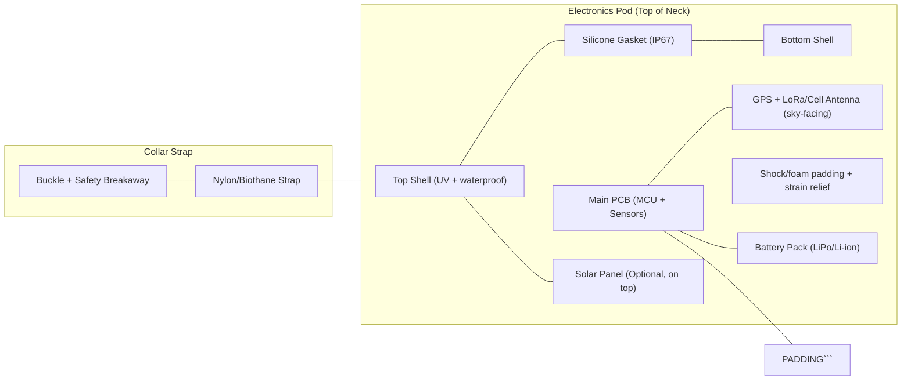
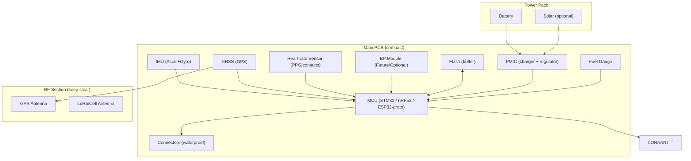
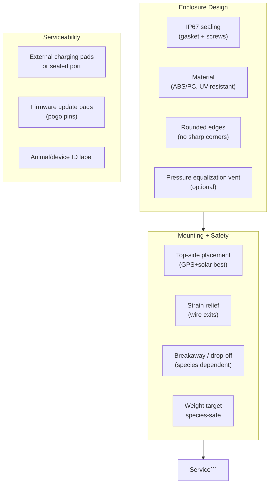

# Collar Device Physical Design

```mermaid
flowchart LR
  subgraph Collar["Collar Strap"]
    STRAP["Nylon/Biothane Strap"]
    BUCKLE["Buckle + Safety Breakaway"]
  end

  subgraph Pod["Electronics Pod (Top of Neck)"]
    TOP["Top Shell (UV + waterproof)"]
    GASKET["Silicone Gasket (IP67)"]
    PCB["Main PCB (MCU + Sensors)"]
    ANT["GPS + LoRa/Cell Antenna (sky-facing)"]
    BAT["Battery Pack (LiPo/Li-ion)"]
    SOLAR["Solar Panel (Optional, on top)"]
    PADDING["Shock/foam padding + strain relief"]
    BOTTOM["Bottom Shell"]
  end

  STRAP --- Pod
  BUCKLE --- STRAP

  TOP --- GASKET --- BOTTOM
  TOP --- SOLAR
  PCB --- ANT
  PCB --- BAT
  PCB --- PADDING```
```

# PCB Design

```mermaid
flowchart TB
  subgraph PCB["Main PCB (compact)"]
    MCU["MCU (STM32 / nRF52 / ESP32-proto)"]
    IMU["IMU (Accel+Gyro)"]
    GNSS["GNSS (GPS)"]
    HR["Heart-rate Sensor (PPG/contacts)"]
    BP["BP Module (Future/Optional)"]
    FLASH["Flash (buffer)"]
    PMIC["PMIC (charger + regulator)"]
    FUEL["Fuel Gauge"]
    CONN["Connectors (waterproof)"]
  end

  subgraph RF["RF Section (keep clear)"]
    GPSANT["GPS Antenna"]
    LORAANT["LoRa/Cell Antenna"]
  end

  subgraph Power["Power Pack"]
    BAT["Battery"]
    SOL["Solar (optional)"]
  end

  IMU --> MCU
  GNSS --> MCU
  HR --> MCU
  BP -.-> MCU
  FLASH <--> MCU

  BAT --> PMIC --> MCU
  SOL -.-> PMIC
  FUEL --> MCU

  MCU --> CONN
  GNSS --> GPSANT
  MCU --> LORAANT```

```

# Mounting Design

```mermaid
flowchart TB
  subgraph Enclosure["Enclosure Design"]
    IP["IP67 sealing\n(gasket + screws)"]
    MAT["Material\n(ABS/PC, UV-resistant)"]
    ROUND["Rounded edges\n(no sharp corners)"]
    VENT["Pressure equalization vent\n(optional)"]
  end

  subgraph Mounting["Mounting + Safety"]
    TOPPOS["Top-side placement\n(GPS+solar best)"]
    STRAIN["Strain relief\n(wire exits)"]
    BREAK["Breakaway / drop-off\n(species dependent)"]
    WEIGHT["Weight target\nspecies-safe"]
  end

  subgraph Service["Serviceability"]
    CHG["External charging pads\nor sealed port"]
    FW["Firmware update pads\n(pogo pins)"]
    LABEL["Animal/device ID label"]
  end

  Enclosure --> Mounting --> Service```

```
